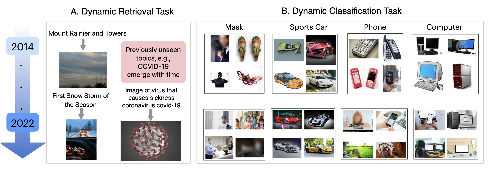
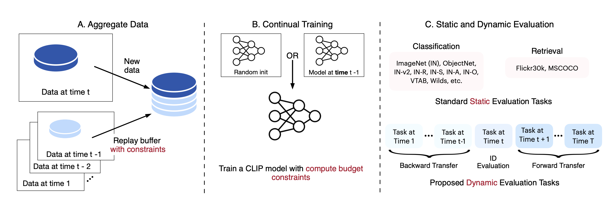

# TiC-CLIP: Continual Training of CLIP Models

[[Paper]](https://arxiv.org/abs/2310.16226) [[Website]]() [[Tweet]](https://twitter.com/saurabh_garg67/status/1717571699720483023)

**Code is coming soon.**

This repository contains our data from the paper: [TiC-CLIP: Continual Training 
of CLIP Models](https://arxiv.org/abs/2310.16226).


## Overview


Our code is adapted from the 
[DataComp](https://github.com/mlfoundations/datacomp) code and we use 
[OpenCLIP](https://github.com/mlfoundations/open_clip/tree/main/src/open_clip) 
for continual training.   

## How to prepare data


### Training data 

TiC-DataComp (yearly data; no filter):

```bash
for year in {2014..2023}; do
  wget https://docs-assets.developer.apple.com/ml-research/datasets/tic-clip/tic-datacomp_training_yearly_noeval/$year.npy
done
```

Number of samples per year are available as 
[sizes.json](https://docs-assets.developer.apple.com/ml-research/datasets/tic-clip/tic-datacomp_training_yearly_noeval/sizes.json).

<!-- TiC-DataComp (yearly data; basic filter): 

TiC-DataComp (yearly data; bestpool filter):  -->

TiC-DataComp (monthly data; no filter): 

```bash
for year in {2014..2023}; do
  wget https://docs-assets.developer.apple.com/ml-research/datasets/tic-clip/tic-datacomp_training_monthly/$year.tar
done
```

Number of samples per year/month are available as 
[sizes.json](https://docs-assets.developer.apple.com/ml-research/datasets/tic-clip/tic-datacomp_training_monthly/sizes.json).

To obtain the training sets, we first need to download the commonpool data.  We 
will soon release a script that will create two directories `metadata` and 
`shards` given the previously downloaded files.

There are three scales in our benchmark:

- `medium`: 128M pool size, 128M examples seen
- `large`: 1.28B pool size, 1.28B examples seen
- `xlarge`: 12.8B pool size, 12.8B examples seen

Along with the images and captions, this script will also download metadata, including `.parquet` files that contain the image urls, captions, and other potentially useful information such as the similarities between the images and captions given by trained OpenAI CLIP models.

### Evaluation data


### Dynamic evaluation
We create retrieval and classification evaluation datasets:

- [TiC-DataComp (Retrieval) Evaluation 
UIDs](https://docs-assets.developer.apple.com/ml-research/datasets/tic-clip/tic-datacomp_retrieval_evals_year2uids.pkl)
- [TiC-DataComp (Classification) Evaluation 
UIDs](https://docs-assets.developer.apple.com/ml-research/datasets/tic-clip/tic-datacompnet_year2uids.pkl)

Examples from our evaluation datasets: 



### Static evaluation

For static evaluation, we follow the protocol in DataComp paper. For standard 
evaluations, we will provide an evaluation script.

## Experimental protocol




## Citation

If you find this repository useful or use this code in your research, please cite the following paper: 

> Garg, S., Farajtabar, M., Pouransari, H., Vemulapalli, R., Mehta, S., Tuzel, O., Shankar, V. and Faghri, F., 2023. TiC-CLIP: Continual Training of CLIP Models. arXiv preprint arXiv:2310.16226. 
```
@article{garg2023tic,
  title={TiC-CLIP: Continual Training of CLIP Models},
  author={Garg, Saurabh and Farajtabar, Mehrdad and Pouransari, Hadi and Vemulapalli, Raviteja and Mehta, Sachin and Tuzel, Oncel and Shankar, Vaishaal and Faghri, Fartash},
  journal={arXiv preprint arXiv:2310.16226},
  year={2023}
}
```

